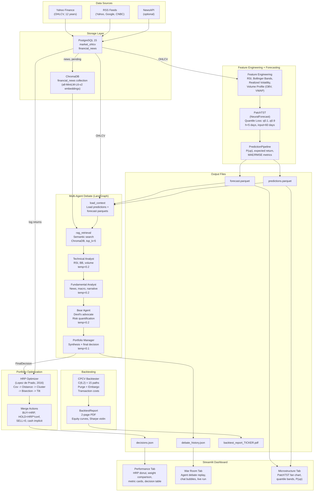
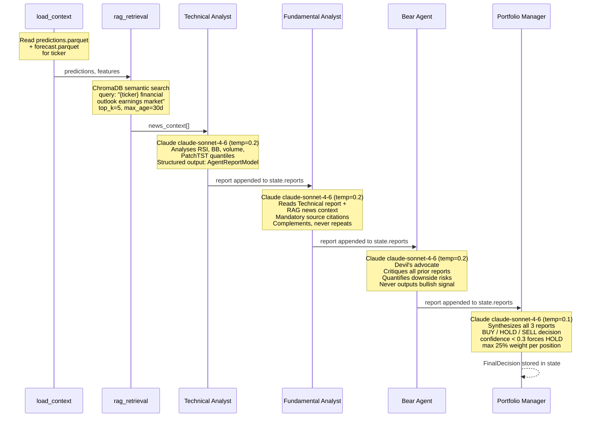

# Titanium Alpha -- System Architecture

## Overview

Titanium Alpha is an agentic multi-strategy hedge fund system that transforms raw market data into actionable portfolio decisions through a pipeline of deep learning forecasting, multi-agent AI debate, and quantitative portfolio optimization. Raw OHLCV prices and financial news are ingested into PostgreSQL, processed through PatchTST (a transformer-based time series model) for probabilistic forecasting, debated by four specialized AI agents orchestrated via LangGraph, and finally allocated using Hierarchical Risk Parity (HRP). The entire pipeline is validated using Combinatorial Purged Cross-Validation (CPCV) to ensure zero look-ahead bias. A Streamlit dashboard presents the results -- portfolio weights, the full agent debate transcript, and quantile forecast visualizations -- to the portfolio manager.

---

## Data Flow Diagram

---

## Module Reference

### `src/utils/db.py` -- Database Connections

| | |
|---|---|
| **Classes/Functions** | `get_postgres_engine()`, `get_chroma_client()` |
| **Responsibilities** | Factory functions for PostgreSQL (SQLAlchemy with connection pooling, `pool_pre_ping=True`) and ChromaDB (HTTP client). All configuration read from environment variables via `python-dotenv`. |
| **Dependencies** | None (leaf module -- no imports from `src/`) |

---

### `src/data/ingestion.py` -- OHLCV Ingestion

| | |
|---|---|
| **Classes/Functions** | `MarketDataIngester` |
| **Responsibilities** | Downloads OHLCV data from Yahoo Finance via `yfinance`, transforms with Polars, validates schema, and upserts into PostgreSQL (`market_ohlcv` table) with `ON CONFLICT` deduplication. Retry with exponential backoff. Default tickers: SPY, NVDA, AAPL, QQQ (5 years). |
| **Dependencies** | `src.utils.db` |

---

### `src/data/news_ingestion.py` -- News Ingestion

| | |
|---|---|
| **Classes/Functions** | `NewsIngester` |
| **Responsibilities** | Fetches financial news from RSS feeds (Yahoo Finance, Google Finance, CNBC) and optionally NewsAPI. Cleans HTML with BeautifulSoup, matches tickers by keywords, deduplicates by URL. Persists to `financial_news` table with `embedding_status` column for downstream RAG processing. |
| **Dependencies** | `src.utils.db` |

---

### `src/models/features.py` -- Feature Engineering

| | |
|---|---|
| **Classes/Functions** | `rsi()`, `bollinger_bands()`, `realized_volatility()`, `volume_profile()`, `compute_all_features()` |
| **Responsibilities** | Computes 9 technical indicators from OHLCV data using backward-only rolling windows (zero look-ahead bias). RSI (SMA variant), Bollinger Bands (SMA +/- n*std), annualized realized volatility (log returns, sqrt(252)), volume profile (SMA, relative volume, cumulative VWAP, OBV). |
| **Dependencies** | None (no imports from `src/`) |

---

### `src/models/patchtst_model.py` -- PatchTST Forecaster

| | |
|---|---|
| **Classes/Functions** | `TitaniumForecaster` |
| **Responsibilities** | Wraps NeuralForecast's PatchTST with multi-quantile loss (q0.1, q0.25, q0.5, q0.75, q0.9). Trains on close price only (channel-independent design). `predict()` returns 5-day-ahead quantile forecasts. `predict_proba()` computes P(up) per ticker. Model persistence via `save()`/`load()` with JSON metadata. Parameters: `input_size=60`, `h=5`, `batch_size=32`, `freq="1bd"`. |
| **Dependencies** | None (no imports from `src/`) |

---

### `src/models/predict.py` -- Prediction Pipeline

| | |
|---|---|
| **Classes/Functions** | `PredictionPipeline` |
| **Responsibilities** | End-to-end orchestrator: loads OHLCV from PostgreSQL, computes features, trains PatchTST, generates forecasts, computes MAE/RMSE metrics, and saves to Parquet files (`predictions.parquet`, `forecast.parquet`, `metrics.parquet`). |
| **Dependencies** | `src.data.ingestion`, `src.models.features`, `src.models.patchtst_model`, `src.utils.db` |

---

### `src/agents/state.py` -- Agent State Definitions

| | |
|---|---|
| **Classes/Functions** | `TickerPrediction`, `AgentReport`, `FinalDecision`, `InvestmentState` (TypedDicts); `make_empty_state()`, `validate_report()`, `validate_decision()` |
| **Responsibilities** | Defines the typed state that flows through the LangGraph pipeline. `InvestmentState` uses `Annotated[list, operator.add]` reducers so each node can append to `reports` and `debate_log` without overwriting. Validation enforces business rules: confidence in [0,1], weight in [0,0.25], confidence < 0.3 forces HOLD. |
| **Dependencies** | None (no imports from `src/`) |

---

### `src/agents/personas.py` -- Agent System Prompts

| | |
|---|---|
| **Classes/Functions** | `TECHNICAL_ANALYST`, `FUNDAMENTALIST_ANALYST`, `BEAR_AGENT`, `PORTFOLIO_MANAGER` (prompt constants); `AgentReportModel`, `FinalDecisionModel` (Pydantic models); `PERSONA_REGISTRY` |
| **Responsibilities** | System prompts that define each agent's personality and constraints. Pydantic models enforce structured JSON output via `ChatAnthropic.with_structured_output()`. The Fundamentalist has mandatory source citation rules; the Bear is constrained to never output bullish signals; the PM caps single-position weight at 25%. |
| **Dependencies** | None (no imports from `src/`) |

---

### `src/agents/graph.py` -- LangGraph Pipeline

| | |
|---|---|
| **Classes/Functions** | `build_investment_graph()`, `run_agent_debate()`, node functions: `load_context()`, `rag_retrieval()`, `technical_analyst()`, `fundamentalist_analyst()`, `bear_agent()`, `portfolio_manager()` |
| **Responsibilities** | Builds and executes the linear LangGraph pipeline (7 nodes). Each analyst node creates a `ChatAnthropic(claude-sonnet-4-6)` instance with structured output. `run_agent_debate()` loops over tickers, invoking the graph once per ticker, and returns both decisions and full graph states for dashboard consumption. Supports streaming via `on_node_complete` callback. |
| **Dependencies** | `src.agents.state`, `src.agents.personas`, `src.agents.rag` (lazy import), `src.data.ingestion` |

---

### `src/agents/rag.py` -- Financial RAG

| | |
|---|---|
| **Classes/Functions** | `FinancialRAG` |
| **Responsibilities** | Embeds pending news articles from PostgreSQL into ChromaDB using `sentence-transformers` (`all-MiniLM-L6-v2`). `embed_pending_news()` reads articles with `embedding_status='pending'`, generates embeddings in batches of 64, upserts to ChromaDB, and marks as `'embedded'` in PostgreSQL. `retrieve()` performs semantic search filtered by ticker, with reranking by recency (date DESC, then distance ASC). Excludes future-dated articles. |
| **Dependencies** | `src.data.news_ingestion`, `src.utils.db` |

---

### `src/backtest/cpcv.py` -- CPCV Backtester

| | |
|---|---|
| **Classes/Functions** | `CPCVBacktester`, `TransactionCosts`, `FoldResult`, `BacktestResult`, `ModelFactory` (Protocol) |
| **Responsibilities** | Implements Combinatorial Purged Cross-Validation (Lopez de Prado). Generates `C(n_splits, n_test_groups)` train/test paths (default: C(6,2) = 15 paths). Each path applies purging (removes `h + input_size - 1 = 64` days before test), embargo (10 days after test), and evaluates a long/flat strategy on non-overlapping h-day returns. Flat positions earn the risk-free rate (geometric conversion). Forced exit cost charged at block end. Optional `TransactionCosts` with slippage, commission, and volume-dependent market impact (`1/sqrt(relative_volume)`). Metrics: annualized Sharpe (rf=0.05, geometric), max drawdown, CAGR. |
| **Dependencies** | None (no imports from `src/`) |

---

### `src/backtest/report.py` -- Backtest Report (PDF)

| | |
|---|---|
| **Classes/Functions** | `BacktestReport` |
| **Responsibilities** | Generates a 2-page PDF from `BacktestResult`. Page 1: metrics table + equity curves overlay. Page 2: Sharpe ratio violin/strip plot + max drawdown bar chart. Uses matplotlib (Agg backend) + seaborn. Output: `data/outputs/backtest_report_{TICKER}.pdf`. |
| **Dependencies** | `src.backtest.cpcv` |

---

### `src/portfolio/hrp.py` -- Hierarchical Risk Parity

| | |
|---|---|
| **Classes/Functions** | `HRPOptimizer`, `HRPConfig`, `HRPResult` |
| **Responsibilities** | Implements the HRP algorithm (Lopez de Prado, 2016). Pipeline: covariance matrix -> correlation distance (`d = sqrt(0.5 * (1 - corr))`) -> hierarchical clustering (scipy linkage) -> quasi-diagonalization (recursive dendrogram traversal) -> recursive bisection (inverse variance weighting). Sum-preserving confidence tilt uses weighted-mean as neutral point (`multiplier = 1 + cap * (confidence - wmean)`). Constraints enforced via waterfilling algorithm with turnover latching (`turnover_threshold=0.02`), dynamic bounds, and iterative redistribution. Accepts `previous_weights` for turnover-aware rebalancing. Polars DataFrames converted to numpy internally. |
| **Dependencies** | None (no imports from `src/`) |

---

### `src/portfolio/decision_engine.py` -- Decision Engine

| | |
|---|---|
| **Classes/Functions** | `DecisionEngine`, `TickerDecision`, `DecisionOutput` |
| **Responsibilities** | Top-level orchestrator. 10-step pipeline: (1) load OHLCV, (2) compute log returns, (3) agent debate, (4) load PatchTST predictions as fallback, (5) extract confidences (debate + fallback), (6) classify tickers (BUY/HOLD/SELL), (7) filter to investable subset (BUY+HOLD), (8) run HRP on subset, (9) HOLD scaling (weight * confidence) + max_weight enforcement, (10) merge + save. Three-tier model: BUY=HRP weight, HOLD=HRP*confidence (reduced), SELL=0. `sum(weights) <= 1.0` with implicit cash. Metadata v1.1 includes `invested_fraction`, `confidence_source`, `n_buy/n_hold/n_sell`. |
| **Dependencies** | `src.agents.state`, `src.portfolio.hrp`, `src.agents.graph` (lazy), `src.models.predict` (lazy), `src.utils.db` (lazy) |

---

### `src/dashboard/app.py` -- Streamlit Dashboard

| | |
|---|---|
| **Classes/Functions** | `main()`, `tab_performance()`, `tab_war_room()`, `tab_microstructure()` |
| **Responsibilities** | Three-tab Streamlit dashboard that reads only flat files from `data/outputs/` (no PostgreSQL dependency). **Performance**: HRP weight donut chart, raw vs tilted bar chart, metric cards (BUY/HOLD/SELL counts, avg confidence), decision table with reasoning. **War Room**: agent debate replay with styled chat bubbles (color-coded per agent), live debate execution via background thread, debate timeline. **Microstructure**: PatchTST fan chart with 90% and 50% confidence interval bands, P(up) and expected return cards. All data cached with `@st.cache_data(ttl=300)`. |
| **Dependencies** | None at import time (Polars imported lazily inside loaders) |

---

## Agent Topology

---

## Key Design Decisions

| Decision | Rationale | Alternatives Considered |
|---|---|---|
| **Polars over Pandas** | 2-10x faster on OHLCV operations; native lazy evaluation; no implicit index pitfalls; thread-safe. | Pandas (ubiquitous but slower, mutable index issues). |
| **PatchTST on close price only** | PatchTST's channel-independent design (per the original paper) means exogenous features add noise, not signal. Technical features are better consumed by LLM agents who can reason about them contextually. | hist_exog_list (not supported by NeuralForecast PatchTST); multi-channel input (violates channel-independent assumption). |
| **CPCV over simple train/test split** | Eliminates look-ahead bias with purging and embargo. Combinatorial paths (15 by default) provide a distribution of performance metrics instead of a single point estimate, enabling statistical validation. | Walk-forward (single path, no distribution); k-fold (ignores temporal ordering); simple holdout (single estimate, potential leakage). |
| **HRP over mean-variance optimization** | HRP does not require expected return estimates (notoriously unreliable). It is robust to covariance estimation noise and naturally handles correlated assets through hierarchical clustering. | Mean-variance (needs expected returns, fragile to estimation error); equal weight (ignores risk structure); risk parity (no hierarchical structure). |
| **Structured LLM output (Pydantic)** | `ChatAnthropic.with_structured_output()` guarantees JSON schema conformance on every agent response. Eliminates regex parsing, handles edge cases, and enables programmatic validation of confidence bounds and action types. | Free-text parsing (brittle); function calling (similar but less integrated); manual JSON prompting (no schema guarantee). |
| **Single linkage for HRP clustering** | Faithful to Lopez de Prado's original 2016 paper. Single linkage produces elongated clusters that respect the correlation distance topology. | Ward (more balanced clusters but departs from the original method); complete linkage (conservative merging). |
| **Flat file dashboard (no DB in UI)** | The dashboard reads `decisions.json`, `debate_history.json`, and Parquet files. This decouples the UI from infrastructure -- the dashboard works offline, in CI screenshots, and without Docker running. | Direct PostgreSQL queries (adds infrastructure dependency); API layer (over-engineering for a single-user tool). |
| **Log returns for covariance estimation** | Log returns are additive over time and approximately normally distributed, making them suitable for covariance matrix estimation and HRP's distance metric. | Simple returns (non-additive, skewed); excess returns (requires benchmark alignment). |
| **Sum-preserving confidence tilt** | Tilt uses the weighted-mean confidence as neutral point, ensuring `sum(tilted) == sum(raw)` exactly. Cap at 20% limits individual adjustments while preserving total allocation. Combined with waterfilling constraint optimizer that enforces min/max weight with turnover latching. | Fixed 0.5 neutral (biased when all agents agree); uncapped tilt (agent overrides risk model); clip-and-renormalise (doesn't preserve sum). |

---

## Testing Strategy

**Scale**: 750+ tests across 15+ test modules.

### Test Layers

| Layer | Scope | Examples |
|---|---|---|
| **Unit** | Individual functions and methods in isolation | `test_features.py` (30 tests): RSI edge cases, Bollinger Band widths, look-ahead bias detection via column-by-column validation |
| **Integration** | Module interactions with mocked infrastructure | `test_predict.py` (12 tests): PostgreSQL load -> feature compute -> PatchTST train -> Parquet roundtrip |
| **Contract** | LangGraph node inputs/outputs and state shape | `test_graph.py` (36 tests): each node receives correct state, appends to reducers, structured output validates |
| **Validation** | Financial correctness (quant-reviewer pass) | `test_cpcv.py` (94 tests): purge window excludes input overlap, non-overlapping returns, equity curve monotonicity under zero-cost flat strategy |

### Mock Patterns

- **Database**: `mock_engine` fixture (SQLAlchemy) with in-memory state; never touches real PostgreSQL.
- **LLM calls**: `patch("langchain_anthropic.ChatAnthropic")` with a shared iterator of mock responses per node, returning pre-built Pydantic model instances.
- **PatchTST**: Both `PatchTST` (NeuralForecast model class) and `NeuralForecast` (wrapper) are patched; `fit()` is a no-op, `predict()` returns a fixture DataFrame.
- **ChromaDB/RAG**: Mock `SentenceTransformer` class and ChromaDB collection; `embed_pending_news` verifies batch calls without real embeddings.
- **External APIs**: `yfinance.download` and `feedparser.parse` are always mocked; zero real HTTP calls in CI.

### Quant-Reviewer Validation

Every module involving financial logic (features, PatchTST, CPCV, HRP, decision engine) was reviewed by an automated quant-reviewer agent that checks for:

- **Look-ahead bias**: all rolling windows are backward-only; CPCV purge window is conservatively sized at `h + input_size - 1`.
- **Sharpe inflation**: non-overlapping returns (every `h` days) prevent autocorrelation; `ddof=1` for sample standard deviation.
- **Data leakage**: train/test separation verified through purge zone, embargo zone, and contiguous block evaluation.
- **Numerical stability**: near-zero variance warnings, division-by-zero guards, correlation matrix clipping to [-1, 1].
