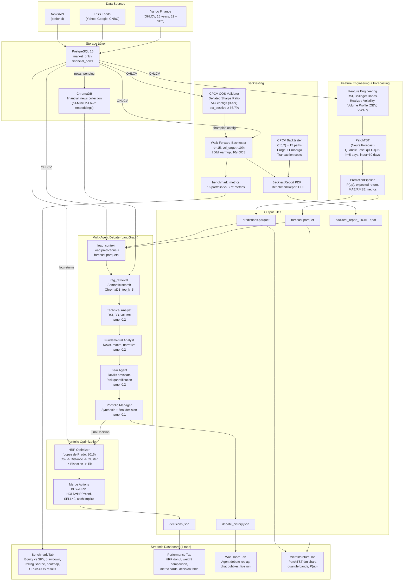
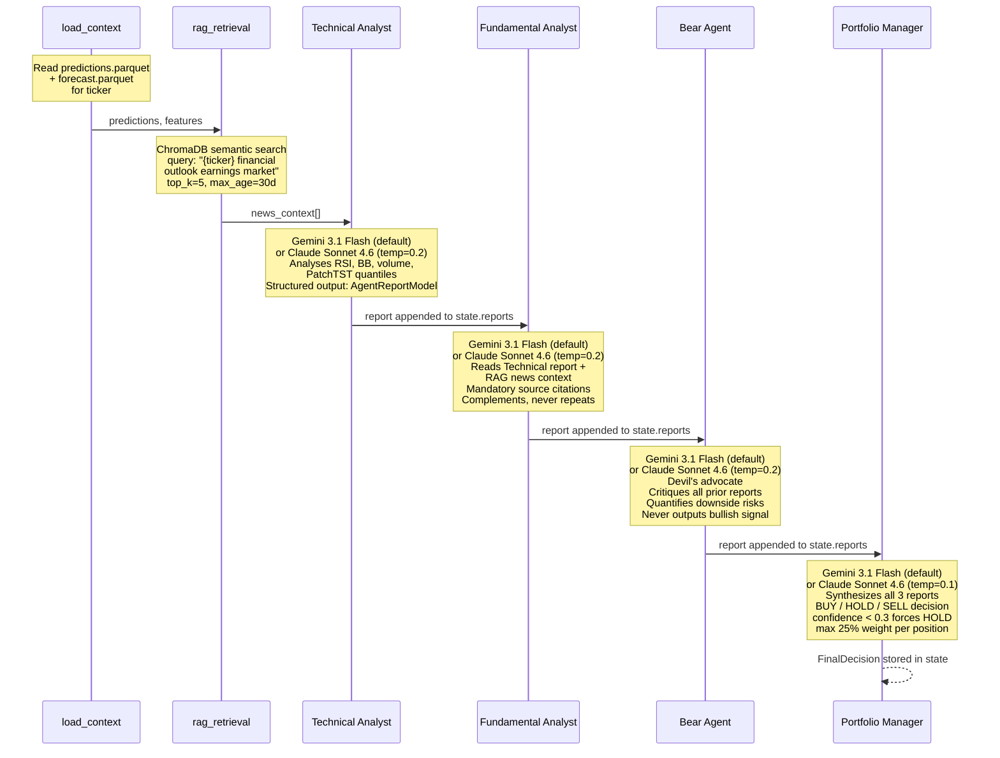

# Titanium Alpha -- System Architecture

## Overview

Titanium Alpha is an agentic multi-strategy hedge fund system that transforms raw market data into actionable portfolio decisions through a pipeline of deep learning forecasting, multi-agent AI debate, and quantitative portfolio optimization. Raw OHLCV prices (15 years, 52 US large caps + SPY benchmark) and financial news are ingested into PostgreSQL, processed through PatchTST (a transformer-based time series model) for probabilistic forecasting, debated by four specialized AI agents orchestrated via LangGraph (Gemini by default, Claude Sonnet 4.6 optional), and finally allocated using Hierarchical Risk Parity with **Ledoit-Wolf covariance shrinkage** and Ward linkage. The entire pipeline is validated through two independent layers: **CPCV-OOS parameter optimization with Deflated Sharpe Ratio** (547 configs across a three-tier grid search), and a **walk-forward benchmark** with 10% volatility targeting, triweekly rebalancing and semi-annual PatchTST retraining -- yielding 10 years of out-of-sample equity after a 756-day covariance warmup. A four-tab Streamlit dashboard (Benchmark, Performance, War Room, Microstructure) presents the results -- 16 portfolio-vs-benchmark metrics, the full agent debate transcript, and quantile forecast fan charts -- to the portfolio manager.

---

## Data Flow Diagram

---

## Module Reference

### `src/utils/db.py` -- Database Connections

| | |
|---|---|
| **Classes/Functions** | `get_postgres_engine()`, `get_chroma_client()` |
| **Responsibilities** | Factory functions for PostgreSQL (SQLAlchemy with connection pooling, `pool_pre_ping=True`) and ChromaDB (HTTP client). All configuration read from environment variables via `python-dotenv`. |
| **Dependencies** | None (leaf module -- no imports from `src/`) |

---

### `src/data/ingestion.py` -- OHLCV Ingestion

| | |
|---|---|
| **Classes/Functions** | `MarketDataIngester` |
| **Responsibilities** | Downloads OHLCV data from Yahoo Finance via `yfinance`, transforms with Polars, validates schema, and upserts into PostgreSQL (`market_ohlcv` table) with `ON CONFLICT (date, ticker) DO UPDATE` deduplication. Retry with exponential backoff. **Thread-safe**: uses `yf.Ticker().history()` per ticker (not the older `yf.download()` which shares session/cache state across threads and caused 22 of 52 tickers to receive identical data). Full ingest: 52 tickers from `config/tickers.json` + SPY benchmark, 15 years of daily OHLCV with `auto_adjust=True` (split/dividend-adjusted), ~199 k rows. |
| **Dependencies** | `src.utils.db` |

---

### `src/data/news_ingestion.py` -- News Ingestion

| | |
|---|---|
| **Classes/Functions** | `NewsIngester` |
| **Responsibilities** | Fetches financial news from RSS feeds (Yahoo Finance, Google Finance, CNBC) and optionally NewsAPI. Cleans HTML with BeautifulSoup, matches tickers by keywords, deduplicates by URL. Persists to `financial_news` table with `embedding_status` column for downstream RAG processing. |
| **Dependencies** | `src.utils.db` |

---

### `src/models/features.py` -- Feature Engineering

| | |
|---|---|
| **Classes/Functions** | `rsi()`, `bollinger_bands()`, `realized_volatility()`, `volume_profile()`, `compute_all_features()` |
| **Responsibilities** | Computes 9 technical indicators from OHLCV data using backward-only rolling windows (zero look-ahead bias). RSI (SMA variant), Bollinger Bands (SMA +/- n*std), annualized realized volatility (log returns, sqrt(252)), volume profile (SMA, relative volume, cumulative VWAP, OBV). |
| **Dependencies** | None (no imports from `src/`) |

---

### `src/models/patchtst_model.py` -- PatchTST Forecaster

| | |
|---|---|
| **Classes/Functions** | `TitaniumForecaster` |
| **Responsibilities** | Wraps NeuralForecast's PatchTST with multi-quantile loss (q0.1, q0.25, q0.5, q0.75, q0.9). Trains on close price only (channel-independent design). `predict()` returns 5-day-ahead quantile forecasts and applies **CDF rearrangement** (Chernozhukov et al., 2010) to guarantee monotonic quantiles per row, with **NaN guards** that coerce pathological outputs to the last observed close. `predict_proba()` computes a continuous **P(up)** per ticker via CDF interpolation across quantile levels (not a discrete count of positive quantiles). Model persistence via `save()`/`load()` with JSON metadata, enabling training-window cache hits across walk-forward reruns. Parameters: `input_size=60`, `h=5`, `batch_size=32`, `freq="1bd"`. |
| **Dependencies** | None (no imports from `src/`) |

---

### `src/models/predict.py` -- Prediction Pipeline

| | |
|---|---|
| **Classes/Functions** | `PredictionPipeline` |
| **Responsibilities** | End-to-end orchestrator: loads OHLCV from PostgreSQL, computes features, trains PatchTST, generates forecasts, computes MAE/RMSE metrics, and saves to Parquet files (`predictions.parquet`, `forecast.parquet`, `metrics.parquet`). |
| **Dependencies** | `src.data.ingestion`, `src.models.features`, `src.models.patchtst_model`, `src.utils.db` |

---

### `src/agents/state.py` -- Agent State Definitions

| | |
|---|---|
| **Classes/Functions** | `TickerPrediction`, `AgentReport`, `FinalDecision`, `InvestmentState` (TypedDicts); `make_empty_state()`, `validate_report()`, `validate_decision()` |
| **Responsibilities** | Defines the typed state that flows through the LangGraph pipeline. `InvestmentState` uses `Annotated[list, operator.add]` reducers so each node can append to `reports` and `debate_log` without overwriting. Validation enforces business rules: confidence in [0,1], weight in [0,0.25], confidence < 0.3 forces HOLD. |
| **Dependencies** | None (no imports from `src/`) |

---

### `src/agents/personas.py` -- Agent System Prompts

| | |
|---|---|
| **Classes/Functions** | `TECHNICAL_ANALYST`, `FUNDAMENTALIST_ANALYST`, `BEAR_AGENT`, `PORTFOLIO_MANAGER` (prompt constants); `AgentReportModel`, `FinalDecisionModel` (Pydantic models); `PERSONA_REGISTRY` |
| **Responsibilities** | System prompts that define each agent's personality and constraints. Pydantic models enforce structured JSON output via `ChatAnthropic.with_structured_output()`. The Fundamentalist has mandatory source citation rules; the Bear is constrained to never output bullish signals; the PM caps single-position weight at 25%. |
| **Dependencies** | None (no imports from `src/`) |

---

### `src/agents/graph.py` -- LangGraph Pipeline

| | |
|---|---|
| **Classes/Functions** | `build_investment_graph()`, `run_agent_debate()`, node functions: `load_context()`, `rag_retrieval()`, `technical_analyst()`, `fundamentalist_analyst()`, `bear_agent()`, `portfolio_manager()` |
| **Responsibilities** | Builds and executes the linear LangGraph pipeline (7 nodes). Each analyst node creates an LLM client via a provider-agnostic factory -- default `ChatGoogleGenerativeAI(gemini-3.1-flash-lite-preview)` (free tier, 500 requests/day) with `ChatAnthropic(claude-sonnet-4-6)` as a drop-in alternative via `LLM_PROVIDER=anthropic`. Structured output is enforced via `with_structured_output(Pydantic model)` on both providers. `run_agent_debate()` loops over tickers, invoking the graph once per ticker, and returns both decisions and full graph states for dashboard consumption. Supports streaming via `on_node_complete` callback; graceful degradation (empty report, `confidence=0.0`) on quota exhaustion or structured-output parse failures. |
| **Dependencies** | `src.agents.state`, `src.agents.personas`, `src.agents.rag` (lazy import), `src.data.ingestion` |

---

### `src/agents/rag.py` -- Financial RAG

| | |
|---|---|
| **Classes/Functions** | `FinancialRAG` |
| **Responsibilities** | Embeds pending news articles from PostgreSQL into ChromaDB using `sentence-transformers` (`all-MiniLM-L6-v2`). `embed_pending_news()` reads articles with `embedding_status='pending'`, generates embeddings in batches of 64, upserts to ChromaDB, and marks as `'embedded'` in PostgreSQL. `retrieve()` performs semantic search filtered by ticker, with reranking by recency (date DESC, then distance ASC). Excludes future-dated articles. |
| **Dependencies** | `src.data.news_ingestion`, `src.utils.db` |

---

### `src/backtest/cpcv.py` -- CPCV Backtester

| | |
|---|---|
| **Classes/Functions** | `CPCVBacktester`, `TransactionCosts`, `FoldResult`, `BacktestResult`, `ModelFactory` (Protocol) |
| **Responsibilities** | Implements Combinatorial Purged Cross-Validation (Lopez de Prado). Generates `C(n_splits, n_test_groups)` train/test paths (default: C(6,2) = 15 paths). Each path applies purging (removes `h + input_size - 1 = 64` days before test), embargo (10 days after test), and evaluates a long/flat strategy on non-overlapping h-day returns. Flat positions earn the risk-free rate (geometric conversion). Forced exit cost charged at block end. Optional `TransactionCosts` with slippage, commission, and volume-dependent market impact (`1/sqrt(relative_volume)`). Metrics: annualized Sharpe (rf=0.05, geometric), max drawdown, CAGR. |
| **Dependencies** | None (no imports from `src/`) |

---

### `src/backtest/cpcv_oos.py` -- CPCV-OOS Parameter Validator

| | |
|---|---|
| **Classes/Functions** | `CPCVParameterValidator`, `ValidationResult`, `deflated_sharpe_ratio()`, `_PurgedModelFactory` |
| **Responsibilities** | Validates candidate hyperparameter configurations by running CPCV on each and applying the **Deflated Sharpe Ratio** (Bailey & Lopez de Prado, 2014) to adjust for multiple-testing inflation. Converts annualized Sharpe to daily before computing DSR so the variance of Sharpe scales correctly with the number of observations. Uses empirical skewness and kurtosis of excess returns. Acceptance criteria: `pct_positive >= 66.7%` (fraction of CPCV paths with Sharpe > 0) **and** `DSR p-value > 0.95`. Supports **holdout temporal validation**: champion re-evaluated on an unseen tail period with `n_trials=1`, eliminating the multiple-testing penalty. Used by the three-tier grid search (547 configs, ~18h per tier) with resume capability, incremental saves (crash-safe), rolling-average ETA, and cross-tier deduplication. |
| **Dependencies** | `src.backtest.cpcv` |

---

### `src/backtest/walk_forward.py` -- Walk-Forward Backtester

| | |
|---|---|
| **Classes/Functions** | `WalkForwardBacktester`, `WalkForwardConfig`, `WalkForwardResult`, `RebalanceRecord`, `KillswitchConfig`, `NaiveModelFactory`, `ModelFactory` (Protocol) |
| **Responsibilities** | Two-cycle temporal simulation: fast rebalance (`rebalance_every=15` trading days) nested inside slow retrain (`retrain_every=126` days) cycles. Portfolio starts 100% in cash (institutional initialization); a `756`-day covariance warmup consumes the first ~3 years before active equity begins. **Ex-ante** volatility targeting at 10% annualized scales the simulated portfolio (pre-allocation, not post-return) within a 0.5-1.0 leverage band using a 63-day lookback. Cash earns the risk-free rate pro-rata (geometric compounding); margin costs rf + spread. Zero look-ahead bias: `decision_date = t-1`. Optional top-N ticker selection filters to highest-conviction positions at each rebalance with adaptive `max_weight = min(6%, 2/N_selected)`. Bankruptcy safeguard terminates the backtest if capital reaches zero. Forced exit cost charged on any killswitch trigger. `NaiveModelFactory` implements a sigmoid-based 5-day momentum score (validated CPCV-OOS champion, proxy for PatchTST signal). |
| **Dependencies** | `src.portfolio.hrp`, `src.backtest.cpcv` (for `TransactionCosts`) |

---

### `src/backtest/benchmark_metrics.py` -- Portfolio-vs-Benchmark Metrics

| | |
|---|---|
| **Classes/Functions** | `compute_benchmark_metrics()` |
| **Responsibilities** | Computes 16 portfolio-vs-benchmark metrics from daily return series: CAGR, annualized Sharpe (geometric rf), Sortino, Information Ratio, Jensen's alpha (CAPM OLS regression of excess portfolio returns on excess benchmark returns), beta, max drawdown, max drawdown duration (days from peak to recovery), Calmar ratio, tracking error, monthly hit rate (ordered by month), average turnover, total return, annualized volatility, and win rate. Drawdown series peaks initialized at 1.0 (not at the first observation) so the first-day drawdown is correctly zero. |
| **Dependencies** | None (no imports from `src/`) |

---

### `src/backtest/benchmark_report.py` -- Benchmark Report (PDF)

| | |
|---|---|
| **Classes/Functions** | `BenchmarkReport` |
| **Responsibilities** | Generates a 6-page PDF summarizing the walk-forward benchmark: (1) title + 16-metric table, (2) equity curve vs SPY, (3) drawdown panel, (4) rolling 252-day Sharpe, (5) weight heatmap across rebalances, (6) monthly return distribution. Uses matplotlib (Agg backend) + seaborn. Output: `data/outputs/benchmark_report.pdf`. |
| **Dependencies** | `src.backtest.benchmark_metrics` |

---

### `src/backtest/run_benchmark.py` -- Benchmark Orchestrator

| | |
|---|---|
| **Classes/Functions** | `run_us_benchmark()`, `_PatchTSTModelFactory`, `_load_ohlcv_from_postgres()`, `_filter_oos_period()`, `_save_outputs()` |
| **Responsibilities** | End-to-end walk-forward benchmark entry point. Loads 15 years of OHLCV from PostgreSQL for 52 tickers + SPY, filters to the OOS window (`n_years=13` by default so that 10 years of equity remain after the 756-day warmup), resolves the model factory (PatchTST with cached training windows, or `NaiveModelFactory` for CPCV-OOS-faithful runs), wires the validated champion config (`rb=15`, `vol_target=0.10`, Ward + Ledoit-Wolf, `max_weight=min(0.06, 2/N)`, `top_n=None`, `killswitch=None`), runs the walk-forward backtester, computes benchmark metrics, and writes the Parquet/JSON/PDF outputs consumed by the Benchmark tab. |
| **Dependencies** | `src.backtest.walk_forward`, `src.backtest.benchmark_metrics`, `src.backtest.benchmark_report`, `src.utils.db` |

---

### `src/backtest/report.py` -- Backtest Report (PDF)

| | |
|---|---|
| **Classes/Functions** | `BacktestReport` |
| **Responsibilities** | Generates a 2-page PDF from `BacktestResult`. Page 1: metrics table + equity curves overlay. Page 2: Sharpe ratio violin/strip plot + max drawdown bar chart. Uses matplotlib (Agg backend) + seaborn. Output: `data/outputs/backtest_report_{TICKER}.pdf`. |
| **Dependencies** | `src.backtest.cpcv` |

---

### `src/portfolio/hrp.py` -- Hierarchical Risk Parity

| | |
|---|---|
| **Classes/Functions** | `HRPOptimizer`, `HRPConfig`, `HRPResult` |
| **Responsibilities** | Implements the HRP algorithm (Lopez de Prado, 2016). Pipeline: **Ledoit-Wolf shrunk** covariance matrix -> correlation distance (`d = sqrt(0.5 * (1 - corr))`) -> hierarchical clustering via **Ward linkage** (validated champion, more balanced clusters than single linkage on 52-asset portfolios) -> quasi-diagonalization (recursive dendrogram traversal) -> recursive bisection (inverse variance weighting). Sum-preserving confidence tilt uses weighted-mean as neutral point (`multiplier = 1 + cap * (confidence - wmean)`, cap=0.20), so `sum(tilted) == sum(raw)` exactly. Constraints enforced via a **waterfilling** algorithm with turnover latching (`turnover_threshold=0.02`), dynamic `max_weight = min(6%, 2/N)` bounds, and iterative redistribution of capped excess. Accepts `previous_weights` for turnover-aware rebalancing. Polars DataFrames converted to numpy internally. |
| **Dependencies** | None (no imports from `src/`) |

---

### `src/portfolio/decision_engine.py` -- Decision Engine

| | |
|---|---|
| **Classes/Functions** | `DecisionEngine`, `TickerDecision`, `DecisionOutput` |
| **Responsibilities** | Top-level orchestrator. 10-step pipeline: (1) load OHLCV, (2) compute log returns, (3) agent debate, (4) load PatchTST predictions as fallback, (5) extract confidences (debate + fallback), (6) classify tickers (BUY/HOLD/SELL), (7) filter to investable subset (BUY+HOLD), (8) run HRP on subset, (9) HOLD scaling (weight * confidence) + max_weight enforcement, (10) merge + save. Three-tier model: BUY=HRP weight, HOLD=HRP*confidence (reduced), SELL=0. `sum(weights) <= 1.0` with implicit cash. Metadata v1.1 includes `invested_fraction`, `confidence_source`, `n_buy/n_hold/n_sell`. |
| **Dependencies** | `src.agents.state`, `src.portfolio.hrp`, `src.agents.graph` (lazy), `src.models.predict` (lazy), `src.utils.db` (lazy) |

---

### `src/dashboard/app.py` -- Streamlit Dashboard

| | |
|---|---|
| **Classes/Functions** | `main()`, `tab_benchmark()`, `tab_performance()`, `tab_war_room()`, `tab_microstructure()` |
| **Responsibilities** | **Four-tab** Streamlit dashboard that reads only flat files from `data/outputs/` (no PostgreSQL dependency). **Benchmark**: walk-forward equity curve vs SPY, drawdown panel, rolling Sharpe, weight heatmap, 16-metric table, CPCV-OOS grid summary, PDF download. **Performance**: HRP weight donut chart, raw vs tilted bar chart, metric cards (BUY/HOLD/SELL counts, avg confidence, invested fraction), decision table with reasoning. **War Room**: agent debate replay with styled chat bubbles (color-coded per agent), live debate execution via background thread, debate timeline, fallback chain (`decision.get('weight', decision.get('suggested_weight', 0))`) covers both Replay and Live schemas. **Microstructure**: PatchTST fan chart with correctly-ordered 90% and 50% confidence interval bands (sort by quantile level, not alphabetically), P(up) and expected return cards. All data cached with `@st.cache_data(ttl=300)`. |
| **Dependencies** | None at import time (Polars imported lazily inside loaders) |

---

## Agent Topology

---

## Key Design Decisions

| Decision | Rationale | Alternatives Considered |
|---|---|---|
| **Polars over Pandas** | 2-10x faster on OHLCV operations; native lazy evaluation; no implicit index pitfalls; thread-safe. | Pandas (ubiquitous but slower, mutable index issues). |
| **PatchTST on close price only** | PatchTST's channel-independent design (per the original paper) means exogenous features add noise, not signal. Technical features are better consumed by LLM agents who can reason about them contextually. | hist_exog_list (not supported by NeuralForecast PatchTST); multi-channel input (violates channel-independent assumption). |
| **CPCV over simple train/test split** | Eliminates look-ahead bias with purging and embargo. Combinatorial paths (15 by default) provide a distribution of performance metrics instead of a single point estimate, enabling statistical validation. | Walk-forward (single path, no distribution); k-fold (ignores temporal ordering); simple holdout (single estimate, potential leakage). |
| **HRP over mean-variance optimization** | HRP does not require expected return estimates (notoriously unreliable). It is robust to covariance estimation noise and naturally handles correlated assets through hierarchical clustering. | Mean-variance (needs expected returns, fragile to estimation error); equal weight (ignores risk structure); risk parity (no hierarchical structure). |
| **Structured LLM output (Pydantic)** | `ChatAnthropic.with_structured_output()` guarantees JSON schema conformance on every agent response. Eliminates regex parsing, handles edge cases, and enables programmatic validation of confidence bounds and action types. | Free-text parsing (brittle); function calling (similar but less integrated); manual JSON prompting (no schema guarantee). |
| **Ward linkage + Ledoit-Wolf shrinkage for HRP** | CPCV-OOS grid search (547 configs) selected Ward + Ledoit-Wolf as champion. Ward produces more balanced clusters on 52-asset portfolios than single linkage; Ledoit-Wolf shrinks noisy off-diagonal correlations toward a structured target, improving covariance stability on short (~3 year) lookbacks. | Single linkage + sample covariance (the original Lopez de Prado 2016 recipe -- benchmarked 0.03-0.05 Sharpe lower in our CPCV-OOS run, likely due to elongated clusters concentrating risk in a single hierarchical branch). |
| **Volatility targeting at 10%, not pure HRP** | `target_vol=0.10` with a 0.5-1.0 leverage band was the single biggest Sharpe driver in the CPCV-OOS grid search (+0.035 Sharpe vs untargeted HRP). Ex-ante targeting (pre-allocation) avoids the post-hoc leverage feedback loop that amplifies losses after drawdowns. | No vol targeting (higher CAGR but MaxDD -31.7% vs -21.9%); post-hoc targeting (amplifies losses in regime shifts). |
| **CPCV-OOS over CPCV alone for parameter tuning** | CPCV gives a Sharpe distribution, but reporting the best of 547 configs is almost guaranteed to be overfit. The Deflated Sharpe Ratio (Bailey & Lopez de Prado, 2014) adjusts for multiple-testing inflation, and a temporal holdout with `n_trials=1` re-validates the champion with zero selection bias. | CPCV-only (selection bias); single train/test split (no distribution); pick-the-best from grid (overfit, inflated Sharpe). |
| **Flat file dashboard (no DB in UI)** | The dashboard reads `decisions.json`, `debate_history.json`, and Parquet files. This decouples the UI from infrastructure -- the dashboard works offline, in CI screenshots, and without Docker running. | Direct PostgreSQL queries (adds infrastructure dependency); API layer (over-engineering for a single-user tool). |
| **Log returns for covariance estimation** | Log returns are additive over time and approximately normally distributed, making them suitable for covariance matrix estimation and HRP's distance metric. | Simple returns (non-additive, skewed); excess returns (requires benchmark alignment). |
| **Sum-preserving confidence tilt** | Tilt uses the weighted-mean confidence as neutral point, ensuring `sum(tilted) == sum(raw)` exactly. Cap at 20% limits individual adjustments while preserving total allocation. Combined with waterfilling constraint optimizer that enforces min/max weight with turnover latching. | Fixed 0.5 neutral (biased when all agents agree); uncapped tilt (agent overrides risk model); clip-and-renormalise (doesn't preserve sum). |

---

## Testing Strategy

**Scale**: 1002 tests passing across 20+ test modules; `src.agents` coverage at 90% (graph.py 84%, rag.py 100%).

### Test Layers

| Layer | Scope | Examples |
|---|---|---|
| **Unit** | Individual functions and methods in isolation | `test_features.py` (30 tests): RSI edge cases, Bollinger Band widths, look-ahead bias detection via column-by-column validation |
| **Integration** | Module interactions with mocked infrastructure | `test_predict.py` (12 tests): PostgreSQL load -> feature compute -> PatchTST train -> Parquet roundtrip |
| **Contract** | LangGraph node inputs/outputs and state shape | `test_graph.py` (36 tests): each node receives correct state, appends to reducers, structured output validates |
| **Validation** | Financial correctness (quant-reviewer pass) | `test_cpcv.py` (94 tests): purge window excludes input overlap, non-overlapping returns, equity curve monotonicity under zero-cost flat strategy |

### Mock Patterns

- **Database**: `mock_engine` fixture (SQLAlchemy) with in-memory state; never touches real PostgreSQL.
- **LLM calls**: `patch("langchain_anthropic.ChatAnthropic")` with a shared iterator of mock responses per node, returning pre-built Pydantic model instances.
- **PatchTST**: Both `PatchTST` (NeuralForecast model class) and `NeuralForecast` (wrapper) are patched; `fit()` is a no-op, `predict()` returns a fixture DataFrame.
- **ChromaDB/RAG**: Mock `SentenceTransformer` class and ChromaDB collection; `embed_pending_news` verifies batch calls without real embeddings.
- **External APIs**: `yf.Ticker` (with a stub `.history()` returning a fixture DataFrame) and `feedparser.parse` are always mocked; zero real HTTP calls in CI. LLM clients (`ChatGoogleGenerativeAI`, `ChatAnthropic`) are patched with a shared iterator of pre-built Pydantic model instances per node, so the full 4-agent debate runs deterministically in tests.

### Quant-Reviewer Validation

Every module involving financial logic (features, PatchTST, CPCV, HRP, decision engine) was reviewed by an automated quant-reviewer agent that checks for:

- **Look-ahead bias**: all rolling windows are backward-only; CPCV purge window is conservatively sized at `h + input_size - 1`.
- **Sharpe inflation**: non-overlapping returns (every `h` days) prevent autocorrelation; `ddof=1` for sample standard deviation.
- **Data leakage**: train/test separation verified through purge zone, embargo zone, and contiguous block evaluation.
- **Numerical stability**: near-zero variance warnings, division-by-zero guards, correlation matrix clipping to [-1, 1].
