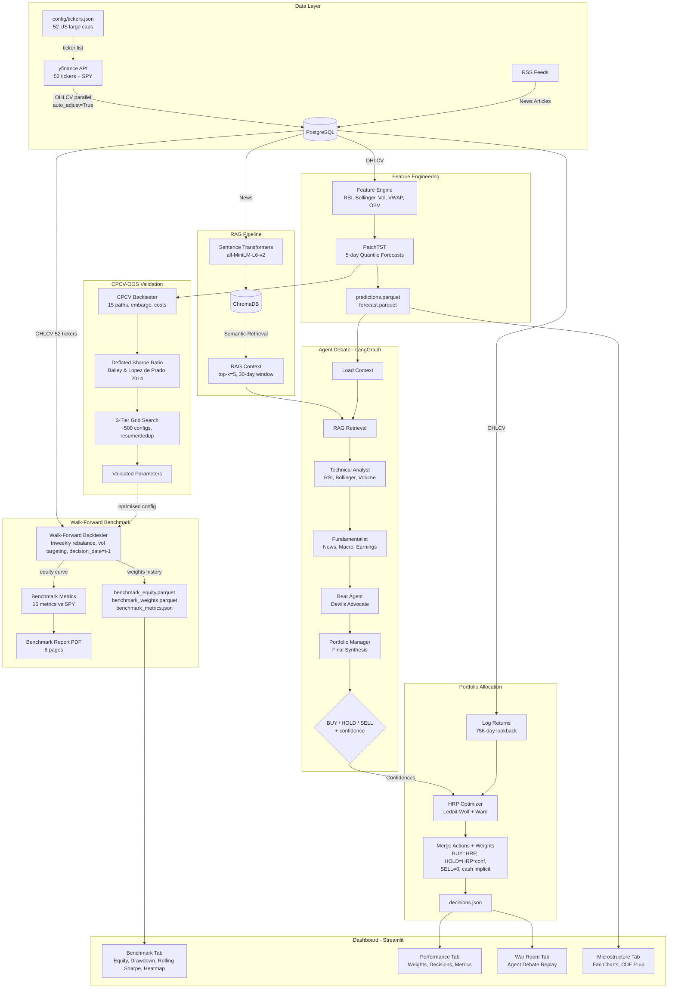

# Titanium Alpha


An **agentic multi-strategy hedge fund system** that uses AI agents to debate investment decisions the way a real trading desk operates. Four specialized agents -- a Technical Analyst, a Fundamentalist, a Devil's Advocate, and a Portfolio Manager -- analyse deep learning forecasts, financial news, and market data, then argue their positions before committing capital. The system validates every strategy through **CPCV-OOS parameter optimization with Deflated Sharpe Ratio**, a **walk-forward backtest across 52 S&P 500 constituents** with triweekly rebalancing, volatility targeting, and risk-free cash carry -- then allocates risk using **Hierarchical Risk Parity with Ledoit-Wolf shrinkage**. A **three-tier fine-tuning grid search** (547 configs) with resume capability, PatchTST model caching, and top-N ticker selection enables systematic parameter optimization at scale.

---

## Why This Matters

Traditional quantitative trading systems rely on a single model making a single prediction. When that model is wrong, there is no safety net.

Titanium Alpha takes a fundamentally different approach:

- **Multiple perspectives reduce blind spots.** A technical analyst may see a bullish RSI divergence while the bear agent identifies an earnings risk. The portfolio manager weighs both views before deciding -- mimicking how the best hedge fund teams actually operate.

- **Deep learning captures patterns that rules cannot.** PatchTST (a transformer architecture purpose-built for time series) forecasts 5-day returns with quantile uncertainty bands. CDF interpolation produces continuous P(up) probabilities per ticker rather than crude discrete counts.

- **Memory matters.** A RAG pipeline embeds financial news into ChromaDB, giving agents access to recent events -- earnings surprises, macro shifts, sector rotations -- so decisions are grounded in reality, not just price charts.

- **Every strategy parameter is validated before deployment.** A **three-tier fine-tuning grid search** (547 configs across 3 tiers, ~18h per tier) with CPCV-OOS (Combinatorial Purged Cross-Validation Out-of-Sample) and **Deflated Sharpe Ratio** (Bailey & Lopez de Prado, 2014) tests configurations across 15 non-overlapping paths. The champion is then validated on a **temporal holdout period** (2 years, unseen by the grid search) with `n_trials=1` -- eliminating the multiple-testing penalty. Resume capability, incremental saves (crash-safe), ETA estimation, and cross-tier deduplication ensure no wasted compute. Only parameters with `pct_positive >= 66.7%` and `DSR p-value > 0.95` are accepted.

- **Walk-forward benchmark with rigorous temporal discipline.** A full temporal simulation across 52 US large-cap stocks with **triweekly rebalancing** (15 trading days), semi-annual PatchTST retraining, **10% annualized volatility targeting**, and **zero look-ahead bias** (decisions use only data up to t-1, returns are earned at t). Optional **top-N ticker selection** filters to the highest-conviction positions at each rebalance. Cash earns the risk-free rate pro-rata; margin (when leveraged) costs rf + spread. Transaction costs (slippage + commission) applied on every position change. **PatchTST model caching** avoids redundant retraining across runs with identical training windows. 16 portfolio-vs-benchmark metrics computed automatically.

- **Risk allocation is mathematically principled.** Hierarchical Risk Parity (Lopez de Prado, 2016) with **Ledoit-Wolf covariance shrinkage**, confidence tilt from model signals (cap=0.20), and dynamic weight caps (`min(6%, 2/N)`) that scale automatically with the number of assets.

The result is an end-to-end system where every component -- from data ingestion to portfolio allocation -- is production-grade, fully tested, and designed to make better decisions under uncertainty.

---

## Key Results (Walk-Forward Benchmark, 52 Tickers, 2016--2026)

| Metric | Fine-Tuned (record) | Pre-Tuning Baseline | Benchmark (SPY) |
|---|---|---|---|
| **Sharpe Ratio** | **0.712** | 0.611 | -- |
| **CAGR** | 13.35% | 14.62% | ~13.5% |
| **Total Return** | 140% | 197% | 157% |
| **Max Drawdown** | **-18.43%** | -31.69% | -- |
| **Sortino Ratio** | 1.000 | -- | -- |
| **Calmar Ratio** | 0.725 | -- | -- |
| **Alpha (CAPM)** | +2.70% | +2.38% | -- |
| **Beta** | 0.532 | 0.842 | 1.0 |
| **Ann. Volatility** | 11.73% | -- | -- |

> **Note:** The fine-tuned config (rb=15, vol_target=10%, max_weight=6%, Ward+Ledoit-Wolf) was identified by a 3-tier CPCV-OOS grid search (547 configs). Volatility targeting at 10% annualized dramatically improved risk-adjusted returns: Sharpe +16% (0.611 -> 0.712), MaxDD halved (-31.7% -> -18.4%), beta cut from 0.84 to 0.53. The trade-off is lower raw CAGR (13.35% vs 14.62%) due to reduced exposure in high-volatility periods. Both use NaiveModelFactory on clean data (12 years, thread-safe `yf.Ticker().history()`) with 756-day covariance lookback and semi-annual retraining. The multi-agent debate layer has not yet been backtested. See [docs/design_gap_backtest_vs_production.md](docs/design_gap_backtest_vs_production.md) for details.

---

## Architecture



---

## Key Features

| Component | Description |
|---|---|
| **PatchTST Forecaster** | Transformer-based 5-day return forecasting with quantile uncertainty (10th, 25th, 50th, 75th, 90th percentiles). CDF interpolation with **monotonicity rearrangement** produces continuous P(up) probability per ticker. NaN/infinity guards prevent corrupt predictions. `get_params()` and cache-aware `load()` enable deterministic model caching across walk-forward runs. Supports both old and new NeuralForecast column naming conventions. |
| **Multi-Agent Debate** | Four Gemini agents with distinct personas debate each ticker through a LangGraph pipeline. Structured output via Pydantic ensures machine-readable decisions. Live streaming mode with per-node callbacks. Anthropic Claude also supported via `LLM_PROVIDER=anthropic`. |
| **Financial RAG** | News articles embedded with sentence-transformers, stored in ChromaDB, retrieved by semantic similarity with date-aware reranking. Agents cite sources -- never hallucinate news. |
| **CPCV-OOS Validation** | **Three-tier fine-tuning grid search** (547 configs, ~18h per tier). Tier 1: single-axis sweeps + key 2-way interactions (249 configs). Tier 2: factorial combinations on promising dimensions (149 configs). Tier 3: fine-grain refinement on champion sweet spot (149 configs). Resume capability skips already-computed configs on restart; incremental saves every 5 configs (crash-safe); rolling-average ETA; cross-tier deduplication. **Holdout temporal validation**: champion tested on unseen 2-year holdout period with `n_trials=1` (no multiple-testing penalty). Deflated Sharpe Ratio (Bailey & Lopez de Prado, 2014) with empirical skewness/kurtosis on excess returns. Acceptance criteria: `pct_positive >= 66.7%` and `DSR p-value > 0.95`. |
| **Walk-Forward Benchmark** | Full temporal simulation across 52 US large-cap stocks with **triweekly rebalancing** (15 trading days, CPCV-OOS validated), semi-annual PatchTST retraining (126 days), 756-day covariance lookback (~3 years), **10% annualized volatility targeting** (63-day lookback, 0.5-1.0 leverage band), and **zero look-ahead bias** (`decision_date = t-1`). Portfolio starts 100% in cash (institutional initialization). Optional **top-N ticker selection** filters to highest-conviction positions at each rebalance with adaptive `max_weight = min(6%, 2/N_selected)`. **PatchTST model caching** (hash of training window + hyperparameters) avoids redundant retraining. Cash earns rf pro-rata (geometric compounding); margin costs rf + spread. Ex-ante volatility targeting uses simulated portfolio returns (pre-allocation, not post-return). Bankruptcy safeguard terminates backtest if capital reaches zero. Compared against SPY buy-and-hold. Sigmoid-based momentum scoring in NaiveModelFactory replaces linear clamp for smoother confidence curves. |
| **Benchmark Metrics** | 16 portfolio-vs-benchmark metrics: CAGR, Sharpe, Sortino, Information Ratio, Jensen's alpha (CAPM OLS), beta, max drawdown, max drawdown duration, Calmar ratio, tracking error, monthly hit rate, avg turnover, and more. |
| **HRP Allocation** | Hierarchical Risk Parity with **Ledoit-Wolf covariance shrinkage**, sum-preserving confidence tilt (weighted-mean neutral, cap=0.20), waterfilling constraint optimizer with turnover latching (`turnover_threshold=0.02`). Dynamic weight caps (`min(6%, 2/N)`) that scale with the number of assets. Supports `previous_weights` for turnover-aware rebalancing. |
| **Transaction Cost Model** | Slippage (5 bps), commission (10 bps), and liquidity-aware market impact (`1/sqrt(relative_volume)`) applied per position change. Turnover threshold (`min_rebalance_delta=0.02`) to skip dust rebalances. |
| **Data Ingestion** | `yf.Ticker().history()` with `auto_adjust=True` ensures split- and dividend-adjusted OHLCV prices throughout. Thread-safe per-ticker objects prevent data corruption in parallel downloads (the older `yf.download()` API shares internal session/cache state across threads, causing adjacent tickers to receive identical data). 12 years of history (2014--2026) for 52 tickers + SPY benchmark. |
| **Streamlit Dashboard** | Four-tab interface: benchmark (equity curve, drawdown, rolling Sharpe, weight heatmap, CPCV-OOS results), portfolio performance (donut + bar charts), war room (agent debate replay with live streaming), and microstructure (fan charts with quantile bands and last-close reference line). |
| **Feature Engineering** | RSI, Bollinger Bands, realized volatility, VWAP, OBV, relative volume -- all implemented in Polars with zero look-ahead bias (verified by quant reviewer). |

---

## Quick Start

```bash
# 1. Clone and install dependencies
git clone https://github.com/your-username/titanium-alpha.git
cd titanium-alpha && poetry install --no-root

# 2. Start PostgreSQL and ChromaDB
docker compose -f docker/docker-compose.yml up -d

# 3. Configure environment variables
cp .env.example .env  # then fill in API keys

# 4. Ingest market data (52 US tickers + SPY, parallel download, auto_adjust=True)
make ingest

# 5. Run PatchTST predictions
make predict

# 6. Run walk-forward benchmark vs S&P 500
make benchmark          # PatchTST model (production, cached)
make benchmark-fast     # NaiveModelFactory (quick validation)
# Optional: top-N ticker selection
python -m src.backtest.run_benchmark --top-n=10

# 7. Fine-tune parameters with CPCV-OOS (three-tier grid search)
python -m src.backtest.run_validation --tier 1       # Day 1 (~165 configs, ~18h)
python -m src.backtest.run_validation --tier 2       # Day 2 (~165 configs, ~18h)
python -m src.backtest.run_validation --tier 3       # Day 3 (~170 configs, ~18h)
python -m src.backtest.run_validation --holdout      # Validate champion on 2-year holdout
python -m src.backtest.run_validation --holdout --holdout-years=3
python -m src.backtest.run_validation --dry-run      # Print grid, no execution
python -m src.backtest.run_validation --estimate     # Time 1 config
make validate           # Full validation (all tiers)
make validate-fast      # Tier 1 only

# 8. Run agent debate + portfolio allocation (requires ANTHROPIC_API_KEY)
make decide

# 9. Launch the dashboard
make run
```

> **Prerequisites:** Python 3.10+, [Poetry](https://python-poetry.org/), Docker, and an `.env` file with database credentials and API keys. See `.env.example` for required variables.

---

## Project Structure

```
titanium-alpha/
|-- src/
|   |-- config.py           Ticker configuration loader (52 US + SPY benchmark)
|   |-- data/               Data ingestion (yfinance OHLCV + RSS/NewsAPI, parallel download)
|   |-- models/             PatchTST forecaster, feature engineering, prediction pipeline
|   |-- agents/             LangGraph debate graph, personas, state management, RAG
|   |-- backtest/           CPCV, CPCV-OOS validator, walk-forward backtester, benchmark metrics
|   |-- portfolio/          HRP optimizer (Ledoit-Wolf, ward linkage), decision engine
|   |-- dashboard/          Streamlit app (4 tabs: Benchmark, Performance, War Room, Microstructure)
|   |-- utils/              Database connections (PostgreSQL, ChromaDB)
|-- config/                 tickers.json (52 US large caps, SPY benchmark)
|-- tests/                  1002 tests (pytest), fixtures in conftest.py
|-- docker/                 docker-compose.yml (PostgreSQL 15 + ChromaDB)
|-- docs/                   Architecture, backtest metrics, design gap analysis, research notes
|-- notebooks/              Exploration only (never imported by src/)
|-- data/outputs/           Pipeline artifacts (predictions, decisions, equity curves, reports)
|-- models/checkpoints/     Saved PatchTST model weights
|-- models/wf_cache/        PatchTST walk-forward cache (hash-based, auto-managed)
|-- Makefile                setup, ingest, predict, decide, benchmark, validate, test, lint, run
|-- pyproject.toml          Poetry config, ruff, mypy, pytest settings
```

---

## How It Works

### Decision Pipeline

The `DecisionEngine` orchestrates the live decision pipeline in ten steps:

```python
from src.portfolio.decision_engine import DecisionEngine

engine = DecisionEngine()
output = engine.run()

# output.decisions -> per-ticker BUY/HOLD/SELL with HRP weights
# output.hrp_final_weights -> {"AAPL": 0.04, "NVDA": 0.03, ...}  (investable tickers)
# output.metadata -> invested_fraction, confidence_source, n_buy/n_hold/n_sell
```

**Pipeline steps:**

1. **Load OHLCV** from PostgreSQL (52 US large caps from `config/tickers.json`)
2. **Compute log returns** in wide format, trimmed to a 504-day lookback window
3. **Run agent debate** -- four Claude agents analyse PatchTST forecasts and RAG-retrieved news, producing BUY/HOLD/SELL with confidence scores per ticker
4. **Load PatchTST predictions** (`predictions.parquet`) as fallback confidence source
5. **Extract confidences** from the debate; missing tickers use PatchTST `prob_up` fallback (or 0.5 if neither is available)
6. **Classify tickers** into BUY, HOLD, and SELL groups (no debate = BUY)
7. **Filter to investable subset** (BUY + HOLD only) for HRP
8. **Run HRP** on the investable subset with Ledoit-Wolf shrinkage and confidence tilt (cap=0.20), dynamic `max_weight = min(6%, 2/N)`
9. **HOLD scaling** -- HOLD tickers get `weight * confidence` (reduced but non-zero); max_weight enforced without renormalization; `sum(weights) <= 1.0` with implicit cash
10. **Save** `decisions.json` and `debate_history.json` for dashboard consumption

**Three-tier weight model:** BUY tickers receive full HRP weight, HOLD tickers receive HRP weight scaled by confidence (< 0.3 by rule, so significantly reduced), SELL tickers get weight 0. The gap between `sum(weights)` and 1.0 is implicit cash.

Graceful degradation is built in: if the agent debate fails (no API key, network error), the pipeline loads PatchTST `prob_up` from `predictions.parquet` and applies **percentile-based classification** (bottom 15% SELL, 15-40% HOLD, top 60% BUY; requires minimum 5 tickers). If predictions are also unavailable, all tickers default to BUY with uniform confidence (0.5). See [design gap analysis](docs/design_gap_backtest_vs_production.md) for details.

### Walk-Forward Benchmark

The `WalkForwardBacktester` simulates the strategy historically against SPY buy-and-hold:

```python
from src.backtest.run_benchmark import run_us_benchmark

result = run_us_benchmark(use_patchtst=True)  # or --naive for quick validation

# result.equity_curve -> daily portfolio_value vs benchmark_value
# result.metrics -> 16 metrics (Sharpe, Sortino, alpha, beta, max DD, ...)
# result.rebalance_history -> every rebalance with weights, turnover, costs
```

**Benchmark configuration (baseline):**

| Parameter | Value | Rationale |
|---|---|---|
| Universe | 52 US large caps + SPY | S&P 500 constituents across 9 sectors |
| Rebalance | Triweekly (15 trading days) | CPCV-OOS validated (547 configs); balances alpha capture vs turnover cost |
| Retrain PatchTST | Semi-annual (126 trading days) | Separates slow/fast cycles |
| Lookback | 756 days (~3 years) | CPCV-OOS validated; stable covariance estimation |
| Costs | 5 bps slippage + 10 bps commission | Conservative for US large caps |
| Cash carry | rf pro-rata (5% annual, geometric) | Positive cash earns risk-free rate |
| Margin cost | rf + 150 bps spread (geometric) | Negative cash (leverage) incurs borrow cost |
| Top-N | `None` (all tickers) | Optional; filters to highest-conviction positions per rebalance |
| Vol targeting | 10% annualized, 63-day lookback, 0.5--1.0 leverage | CPCV-OOS validated; single biggest Sharpe driver (+0.035) |
| HRP | Ledoit-Wolf shrinkage, Ward linkage, sum-preserving tilt cap=0.20, max_weight=min(6%, 2/N), turnover_threshold=0.02 | CPCV-OOS validated; conservative tilt, diversified allocation, turnover-aware |
| Min rebalance delta | 2% turnover | Skip dust rebalances |
| Decision cutoff | t-1 (previous close) | Zero look-ahead bias |
| Capital | $1,000,000 | Institutional standard |
| OOS period | 10 years (configurable) | Leap-year safe date filtering |
| PatchTST cache | `models/wf_cache/<hash>/` | Avoids redundant retraining across runs |

Outputs: `benchmark_equity.parquet`, `benchmark_metrics.json`, `benchmark_weights.parquet`, and a 6-page PDF report (equity curve, drawdown, metrics table, rolling Sharpe, weight heatmap, turnover chart).

### CPCV-OOS Parameter Validation

Before deploying any configuration, parameters are validated through Combinatorial Purged Cross-Validation:

```bash
# Three-tier systematic grid search
python -m src.backtest.run_validation --tier 1        # Day 1: single-axis sweeps (~165 configs)
python -m src.backtest.run_validation --tier 2        # Day 2: factorial combos (~165 configs)
python -m src.backtest.run_validation --tier 3        # Day 3: champion refinement (~170 configs)
python -m src.backtest.run_validation --tier all      # Run all sequentially

# Holdout temporal validation (champion tested on unseen period, n_trials=1)
python -m src.backtest.run_validation --holdout                    # 2-year holdout (default)
python -m src.backtest.run_validation --holdout --holdout-years=3  # 3-year holdout
python -m src.backtest.run_validation --tier all --holdout         # Grid search + holdout

# Utilities
python -m src.backtest.run_validation --estimate      # Time 1 config
python -m src.backtest.run_validation --dry-run       # Print grid, no execution
```

The validator:
1. Divides the OOS period into 6 temporal blocks
2. Generates C(6,2) = 15 combinatorial paths with purge + embargo
3. Runs the walk-forward backtester on each path independently
4. Computes Deflated Sharpe Ratio (corrects for multiple testing)
5. Accepts only configurations with `pct_positive >= 66.7%` AND `DSR p-value > 0.95`
6. **Holdout validation**: champion is tested on a reserved temporal period (default 2 years) that the grid search never sees, with `n_trials=1` -- eliminating the multiple-testing penalty that makes DSR acceptance nearly impossible with 547 configs

**Operational features:** Resume capability (skips already-computed configs on restart), incremental saves every 5 configs (crash-safe), rolling-average ETA estimation, and cross-tier deduplication (same parameter fingerprint never runs twice). Time budget: ~375s per config (25s x 15 CPCV-OOS paths), ~172 configs per 18h tier.

---

## Testing

The test suite covers every module with 1002 tests:

```bash
make test
# or directly:
poetry run pytest tests/ -v --tb=short
```

**Test coverage highlights:**

| Area | Tests | What is validated |
|---|---|---|
| Data ingestion | 35 | Download, schema, retry, upsert, parallel, partial failure, thread-safe `yf.Ticker().history()` |
| News ingestion | 43 | RSS parsing, dedup, embedding status, ticker matching |
| Feature engineering | 31 | RSI, Bollinger, volatility, volume, no look-ahead bias |
| PatchTST model | 49 | Init, prepare, build, fit, predict, CDF monotonicity rearrangement, NaN guards, `get_params()`, cache-aware load |
| Prediction pipeline | 13 | Load, metrics (MAE/RMSE), Parquet roundtrip |
| Ticker config | 13 | Config loading, fallback, validation, real config |
| Agent state + personas | 58 | TypedDicts, Pydantic models, validation, registry |
| LangGraph graph | 36 | Node execution, RAG integration, full pipeline |
| RAG (ChromaDB) | 40 | Embedding, retrieval, reranking, edge cases |
| CPCV backtest | 94 | Splits, purge, embargo, Sharpe, drawdown, costs |
| CPCV-OOS validator | 66 | DSR math, purged factory, grid search, integration |
| CPCV report | 15 | PDF generation, plots, edge cases |
| Walk-forward backtest | 84 | Config, returns, costs, drift, vol targeting, killswitch, top-N selection, sigmoid momentum, bankruptcy safeguard, look-ahead bias |
| Benchmark metrics | 40 | Sharpe, Sortino, alpha, beta, drawdown, hit rate, edge cases |
| Benchmark report | 19 | PDF 6-page generation, helpers, edge cases |
| Run benchmark | 15 | Filter, model factory, PatchTST caching, save, e2e integration |
| Run validation | 73 | Three-tier grid builders, resume/dedup, holdout temporal validation, champion identification, output savers, HRP integration, pipeline mocked |
| HRP optimizer | 80 | Covariance, clustering, bisection, tilt, Ledoit-Wolf shrinkage, Ward linkage, waterfilling |
| Decision engine | 74 | Returns, merge, classify, percentile-based fallback, HOLD scaling, metadata, debate, JSON output |
| Dashboard | 81 | Loaders, charts, agent styles, streaming, benchmark tab, fan chart sort, schema v1.2 |
| DB utilities | 15 | Connection pooling, env vars, overrides |

All tests use mocks for external dependencies (APIs, databases, LLMs). No real API calls are made during testing.

---

## Tech Stack

| Layer | Technology | Purpose |
|---|---|---|
| Language | Python 3.10+ | Type hints, modern syntax |
| DataFrames | Polars | Fast columnar processing (no Pandas) |
| Deep Learning | NeuralForecast (Nixtla) | PatchTST with MQLoss (5 quantiles) |
| Agents | LangGraph + LangChain | Multi-agent orchestration |
| LLM | Gemini 3.1-flash-lite (Google AI) | Structured output for agent reasoning (Anthropic Claude also supported via `LLM_PROVIDER=anthropic`) |
| Embeddings | sentence-transformers | all-MiniLM-L6-v2 for news embedding |
| Vector Store | ChromaDB | Semantic search over financial news |
| Database | PostgreSQL 15 | OHLCV + news persistence |
| Portfolio | scipy + numpy + scikit-learn | HRP clustering, Ledoit-Wolf shrinkage |
| Backtesting | Custom CPCV + CPCV-OOS + Walk-Forward | Cross-validation + three-tier grid search + temporal benchmark |
| Reporting | matplotlib + seaborn | 6-page benchmark PDF (equity, drawdown, metrics, heatmap) |
| Dashboard | Streamlit + Plotly | Interactive 4-tab interface |
| Logging | loguru | Structured logging (never print()) |
| Config | python-dotenv + JSON | Environment variables + ticker configuration |
| Packaging | Poetry | Dependency management |
| Containers | Docker Compose | PostgreSQL + ChromaDB services |
| Linting | ruff + mypy | Style enforcement + strict type checking |
| CI | GitHub Actions | Automated test + lint on push/PR |
| Testing | pytest | 1002 tests, all mocked |

---

## Known Limitations

- **Backtest-production gap:** The walk-forward benchmark validates NaiveModelFactory (sigmoid momentum) and PatchTST (with model caching). The multi-agent debate pipeline has not yet been backtested with the corrected temporal discipline. See [design gap analysis](docs/design_gap_backtest_vs_production.md).
- **Agent fallback:** When LangGraph agents are unavailable, the decision engine falls back to PatchTST `prob_up` from `predictions.parquet` with **percentile-based classification** (bottom 15% SELL, 15-40% HOLD, top 60% BUY). If predictions are also unavailable, all tickers default to BUY with uniform confidence (0.5).
- **CPCV-OOS acceptance:** Grid search across 547 configs (3 tiers) found 0 DSR-accepted configurations when penalised for multiple testing. A **holdout temporal validation** approach (`--holdout`) addresses this: the champion is tested on a reserved 2-year period the grid search never sees, with `n_trials=1` (no multiple-testing penalty). The current champion (rb=15, vol_target=10%, max_weight=6%, Ward+Ledoit-Wolf) achieved Sharpe 0.710 in the full walk-forward benchmark. See [data/outputs/validation_3tier_analysis.md](data/outputs/validation_3tier_analysis.md) for the complete analysis.
- **No short selling:** The system only goes long or flat (no short positions).

---

## License

MIT License. See [LICENSE](LICENSE) for details.
