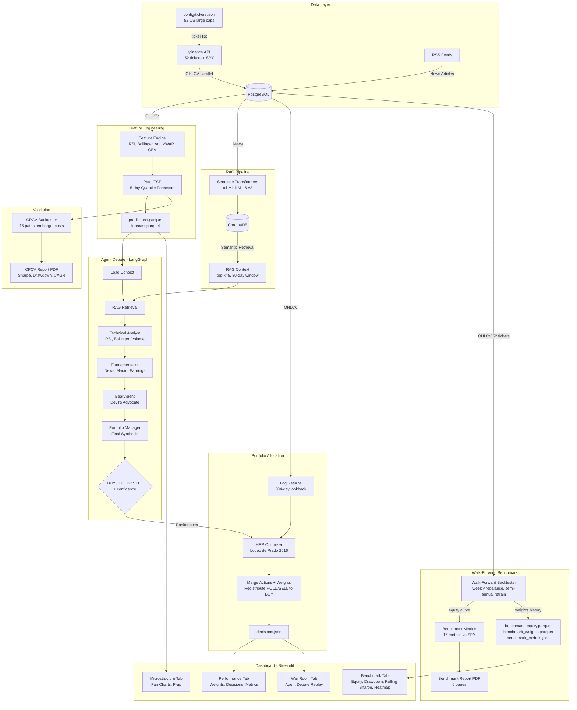

# Titanium Alpha


An **agentic multi-strategy hedge fund system** that uses AI agents to debate investment decisions the way a real trading desk operates. Four specialized agents -- a Technical Analyst, a Fundamentalist, a Devil's Advocate, and a Portfolio Manager -- analyse deep learning forecasts, financial news, and market data, then argue their positions before committing capital. The system validates every strategy through a **walk-forward backtest across 52 S&P 500 constituents** with weekly rebalancing, semi-annual model retraining, and realistic transaction costs -- then allocates risk using the same algorithms employed by institutional quant funds.

---

## Why This Matters

Traditional quantitative trading systems rely on a single model making a single prediction. When that model is wrong, there is no safety net.

Titanium Alpha takes a fundamentally different approach:

- **Multiple perspectives reduce blind spots.** A technical analyst may see a bullish RSI divergence while the bear agent identifies an earnings risk. The portfolio manager weighs both views before deciding -- mimicking how the best hedge fund teams actually operate.

- **Deep learning captures patterns that rules cannot.** PatchTST (a transformer architecture purpose-built for time series) forecasts 5-day returns with quantile uncertainty bands, so the system knows *how confident* its predictions are, not just what they predict.

- **Memory matters.** A RAG pipeline embeds financial news into ChromaDB, giving agents access to recent events -- earnings surprises, macro shifts, sector rotations -- so decisions are grounded in reality, not just price charts.

- **Every strategy is stress-tested before deployment.** Combinatorial Purged Cross-Validation (CPCV) generates 15 non-overlapping backtest paths with embargo periods and transaction costs, eliminating the look-ahead bias and overfitting that plague naive backtests.

- **Walk-forward benchmark against the S&P 500.** A full walk-forward simulation across 52 US large-cap stocks with weekly rebalancing, semi-annual retraining, and transaction costs (slippage + commission) produces an equity curve directly comparable to SPY buy-and-hold. 16 portfolio-vs-benchmark metrics (Sharpe, Sortino, Jensen's alpha, beta, Information Ratio, max drawdown duration, and more) are computed automatically, with a 6-page PDF report and an interactive dashboard tab.

- **Risk allocation is mathematically principled.** Hierarchical Risk Parity (Lopez de Prado, 2016) replaces fragile mean-variance optimization with a clustering-based approach that does not require inverting an unstable covariance matrix. Dynamic weight caps (`min(25%, 2/N)`) scale automatically with the number of assets.

The result is an end-to-end system where every component -- from data ingestion to portfolio allocation -- is production-grade, fully tested, and designed to make better decisions under uncertainty.

---

## Architecture



---

## Key Features

| Component | Description |
|---|---|
| **PatchTST Forecaster** | Transformer-based 5-day return forecasting with quantile uncertainty (10th, 25th, 50th, 75th, 90th percentiles). Produces P(up) probability per ticker. |
| **Multi-Agent Debate** | Four Claude Sonnet agents with distinct personas debate each ticker through a LangGraph pipeline. Structured output via Pydantic ensures machine-readable decisions. |
| **Financial RAG** | News articles embedded with sentence-transformers, stored in ChromaDB, retrieved by semantic similarity with date-aware reranking. Agents cite sources -- never hallucinate news. |
| **CPCV Backtesting** | 15 combinatorial paths with purge windows (64 days), embargo periods (10 days), and configurable transaction costs (slippage + commission + market impact). |
| **Walk-Forward Benchmark** | Full temporal simulation across 52 S&P 500 stocks with weekly rebalancing (5 days), semi-annual PatchTST retraining (126 days), and realistic transaction costs. Per-asset dollar tracking for weight drift between rebalances. Compared against SPY buy-and-hold. |
| **Benchmark Metrics** | 16 portfolio-vs-benchmark metrics: CAGR, Sharpe, Sortino, Information Ratio, Jensen's alpha (CAPM OLS), beta, max drawdown, max drawdown duration, Calmar ratio, tracking error, monthly hit rate, avg turnover, and more. |
| **HRP Allocation** | Hierarchical Risk Parity with confidence tilt from agent debate. Single/complete/average/ward linkage. Dynamic weight caps (`min(25%, 2/N)`) that scale with the number of assets. |
| **Streamlit Dashboard** | Four-tab interface: benchmark (equity curve, drawdown, rolling Sharpe, weight heatmap), portfolio performance (donut + bar charts), war room (agent debate replay with live streaming), and microstructure (fan charts with confidence intervals). |
| **Feature Engineering** | RSI, Bollinger Bands, realized volatility, VWAP, OBV, relative volume -- all implemented in Polars with zero look-ahead bias (verified by quant reviewer). |
| **Transaction Cost Model** | Slippage, commission, and liquidity-aware market impact (`1/sqrt(relative_volume)`) applied per position change in backtests. Turnover threshold (`min_rebalance_delta`) to skip low-impact rebalances. |

---

## Quick Start

```bash
# 1. Clone and install dependencies
git clone https://github.com/your-username/titanium-alpha.git
cd titanium-alpha && poetry install --no-root

# 2. Start PostgreSQL and ChromaDB
docker compose -f docker/docker-compose.yml up -d

# 3. Ingest market data and news (52 US tickers, parallel download)
make ingest

# 4. Run the full decision pipeline (predictions + debate + HRP)
make predict && make decide

# 5. Run walk-forward benchmark vs S&P 500
make benchmark          # PatchTST model (production)
make benchmark-fast     # NaiveModelFactory (quick validation)

# 6. Launch the dashboard
make run
```

> **Prerequisites:** Python 3.10+, [Poetry](https://python-poetry.org/), Docker, and an `.env` file with database credentials and API keys. See `.env.example` for required variables.

---

## Project Structure

```
titanium-alpha/
|-- src/
|   |-- config.py           Ticker configuration loader (52 US + SPY benchmark)
|   |-- data/               Data ingestion (yfinance OHLCV + RSS/NewsAPI, parallel download)
|   |-- models/             PatchTST forecaster, feature engineering, prediction pipeline
|   |-- agents/             LangGraph debate graph, personas, state management, RAG
|   |-- backtest/           CPCV, walk-forward backtester, benchmark metrics, PDF reports
|   |-- portfolio/          HRP optimizer, decision engine (final pipeline)
|   |-- dashboard/          Streamlit app (4 tabs: Benchmark, Performance, War Room, Microstructure)
|   |-- utils/              Database connections (PostgreSQL, ChromaDB)
|-- config/                 tickers.json (52 US large caps, SPY benchmark)
|-- tests/                  500 tests (pytest), fixtures in conftest.py
|-- docker/                 docker-compose.yml (PostgreSQL 15 + ChromaDB)
|-- docs/                   Backtest metrics reference, benchmark plan, research notes
|-- notebooks/              Exploration only (never imported by src/)
|-- data/outputs/           Pipeline artifacts (predictions, decisions, equity curves, reports)
|-- models/checkpoints/     Saved PatchTST model weights
|-- Makefile                setup, ingest, predict, decide, benchmark, test, lint, run, clean
|-- pyproject.toml          Poetry config, ruff, mypy, pytest settings
```

---

## How It Works

### Decision Pipeline

The `DecisionEngine` orchestrates the live decision pipeline in seven steps:

```python
from src.portfolio.decision_engine import DecisionEngine

engine = DecisionEngine()
output = engine.run()

# output.decisions -> per-ticker BUY/HOLD/SELL with HRP weights
# output.hrp_final_weights -> {"AAPL": 0.04, "NVDA": 0.03, ...}  (52 tickers)
# output.metadata -> schema version, HRP config, number of observations
```

**Pipeline steps:**

1. **Load OHLCV** from PostgreSQL (52 US large caps from `config/tickers.json`)
2. **Compute log returns** in wide format, trimmed to a 504-day (~2 year) lookback window
3. **Run agent debate** -- four Claude agents analyse PatchTST forecasts and RAG-retrieved news, producing BUY/HOLD/SELL with confidence scores per ticker
4. **Extract confidences** from the debate (missing tickers default to 0.5 = neutral)
5. **Run HRP** with confidence tilt (agents shift allocation by up to 20%), dynamic `max_weight = min(25%, 2/N)`
6. **Merge actions and weights** -- HOLD/SELL tickers get weight 0, redistributed proportionally to BUY tickers
7. **Save** `decisions.json` and `debate_history.json` for dashboard consumption

Graceful degradation is built in: if the agent debate fails (no API key, network error), the pipeline falls back to pure HRP allocation without confidence tilt.

### Walk-Forward Benchmark

The `WalkForwardBacktester` simulates the strategy historically against SPY buy-and-hold:

```python
from src.backtest.run_benchmark import run_us_benchmark

result = run_us_benchmark(use_patchtst=True)  # or --naive for quick validation

# result.equity_curve -> daily portfolio_value vs benchmark_value
# result.metrics -> 16 metrics (Sharpe, Sortino, alpha, beta, max DD, ...)
# result.rebalance_history -> every rebalance with weights, turnover, costs
```

**Benchmark configuration:**

| Parameter | Value | Rationale |
|---|---|---|
| Universe | 52 US large caps + SPY | S&P 500 constituents across 9 sectors |
| Rebalance | Weekly (5 trading days) | Realistic for active fund |
| Retrain PatchTST | Semi-annual (126 trading days) | Separates slow/fast cycles |
| Lookback | 504 days (~2 years) | Covariance estimation window |
| Costs | 5 bps slippage + 10 bps commission | Conservative for US large caps |
| Capital | $1,000,000 | Institutional standard |
| OOS period | Up to 10 years | Includes bull, bear, COVID, rate hikes |

Outputs: `benchmark_equity.parquet`, `benchmark_metrics.json`, `benchmark_weights.parquet`, and a 6-page PDF report (equity curve, drawdown, metrics table, rolling Sharpe, weight heatmap, turnover chart).

---

## Testing

The test suite covers every module with 500 tests running in under 35 seconds:

```bash
make test
# or directly:
poetry run pytest tests/ -v --tb=short
```

**Test coverage highlights:**

| Area | Tests | What is validated |
|---|---|---|
| Data ingestion | 61 | Download, schema, retry, upsert, parallel, partial failure, date range |
| Feature engineering | 30 | RSI, Bollinger, volatility, volume, no look-ahead bias |
| PatchTST model | 31 | Init, prepare, build, fit, predict, save/load |
| Prediction pipeline | 12 | Load, metrics (MAE/RMSE), Parquet roundtrip |
| Ticker config | 13 | Config loading, fallback, validation, real config |
| Agent state + personas | 58 | TypedDicts, Pydantic models, validation, registry |
| LangGraph graph | 36 | Node execution, RAG integration, full pipeline |
| RAG (ChromaDB) | 40 | Embedding, retrieval, reranking, edge cases |
| CPCV backtest | 94 | Splits, purge, embargo, Sharpe, drawdown, costs |
| CPCV report | 15 | PDF generation, plots, edge cases |
| Walk-forward backtest | 38 | Config, returns, costs, drift, benchmark, look-ahead bias |
| Benchmark metrics | 40 | Sharpe, Sortino, alpha, beta, drawdown, hit rate, edge cases |
| Benchmark report | 19 | PDF 6-page generation, helpers, edge cases |
| Run benchmark | 15 | Filter, model factory, save, e2e integration |
| HRP optimizer | 67 | Covariance, clustering, bisection, tilt, clipping |
| Decision engine | 34 | Returns, merge, debate, dynamic max_weight, JSON output |
| Dashboard | 39 | Loaders, charts, agent styles, streaming, benchmark tab |
| DB utilities | 15 | Connection pooling, env vars, overrides |

All tests use mocks for external dependencies (APIs, databases, LLMs). No real API calls are made during testing.

---

## Tech Stack

| Layer | Technology | Purpose |
|---|---|---|
| Language | Python 3.10+ | Type hints, modern syntax |
| DataFrames | Polars | Fast columnar processing (no Pandas) |
| Deep Learning | NeuralForecast (Nixtla) | PatchTST with quantile loss |
| Agents | LangGraph + LangChain | Multi-agent orchestration |
| LLM | Claude Sonnet (Anthropic) | Structured output for agent reasoning |
| Embeddings | sentence-transformers | all-MiniLM-L6-v2 for news embedding |
| Vector Store | ChromaDB | Semantic search over financial news |
| Database | PostgreSQL 15 | OHLCV + news persistence |
| Portfolio | scipy + numpy | HRP clustering and optimization |
| Backtesting | Custom CPCV + Walk-Forward | CPCV cross-validation + temporal walk-forward benchmark |
| Reporting | matplotlib + seaborn | 6-page benchmark PDF (equity, drawdown, metrics, heatmap) |
| Dashboard | Streamlit + Plotly | Interactive 4-tab interface |
| Logging | loguru | Structured logging (never print()) |
| Config | python-dotenv + JSON | Environment variables + ticker configuration |
| Packaging | Poetry | Dependency management |
| Containers | Docker Compose | PostgreSQL + ChromaDB services |
| Linting | ruff + mypy | Style enforcement + strict type checking |
| Testing | pytest + pytest-mock | 500 tests, all mocked |

---

## License

MIT License. See [LICENSE](LICENSE) for details.
